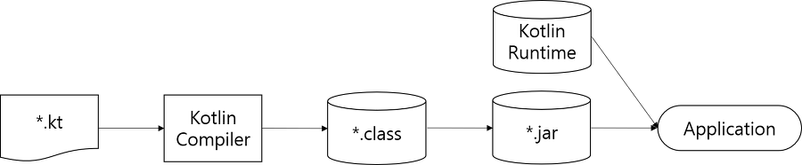

# Chapter 01. 첫 번째 코틀린 애플리케이션 작성하기

## Hello, World!

```kotlin
fun main(args: Array<String>){
  println("Hello, world!")
}
```

## 코틀린 빌드 과정



```bash
# kotlinc 명령을 통해 코드 컴파일
kotlinc <소스파일 또는 디렉터리> -include-runtime -d <jar 이름>
# java 명령으로 코드 실행
java -jar <jar이름>
```

